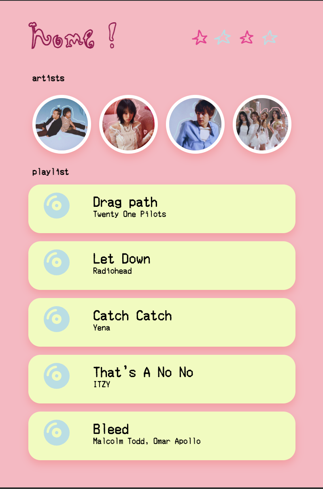
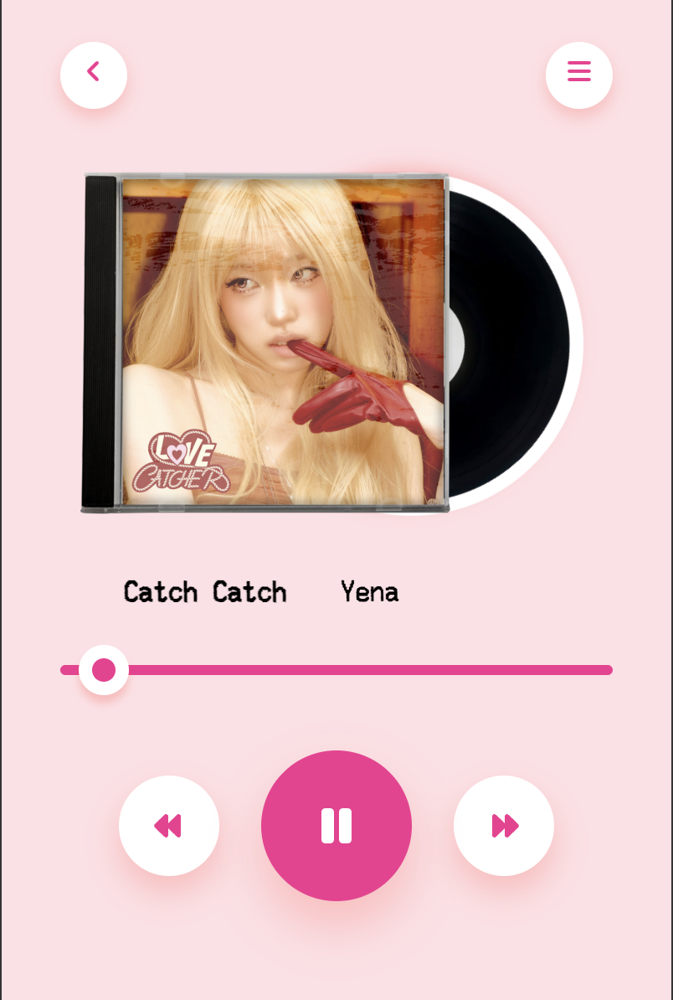

# Music Player

Web music player with five songs in catalogue. 

## Description

Made for Hack Club's Stardance, this is a stylised web music player made using HTML and CSS including five pre-downloaded songs. This project includes a home page and a music player page. The home page allows for users to pick which songs they would like to play, whether by artist or by song title. The music player page allows for audio output, features basic text and image animations. 

Song credits: [Drag Path](https://www.youtube.com/watch?v=TE5vUtfNwzo), [Let Down](https://www.youtube.com/watch?v=gJnvY4lVR1Y), [Catch Catch](https://www.youtube.com/watch?v=NOiyDlWl534), [That's A No No](https://www.youtube.com/watch?v=ajdX8MQVkdo), and [Bleed](https://www.youtube.com/watch?v=ajdX8MQVkdo). 

## Contact
Selina Yunfei Shuai - selinayunfei@gmail.com - [Yunfei Shuai](https://hackclub.enterprise.slack.com/team/U08234LELFP) on Slack. 
